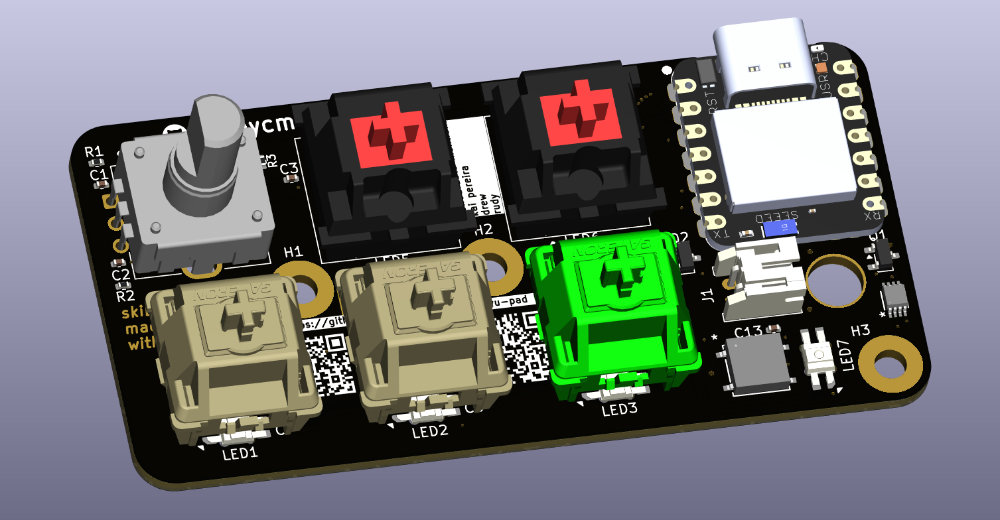
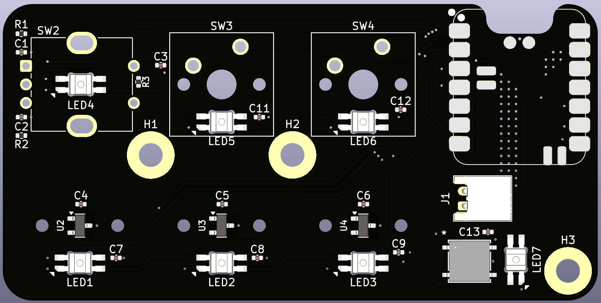
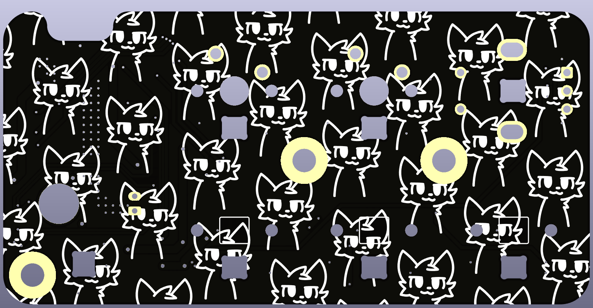

# skibidi-uwu-pad

me when i osu

## features:

- 3 hall effects switches
- 2 cherry mx switches
- 1 rotary encoder with push function
- rgb underglow
- hot swappable keycaps
- customizable firmware via zmk
- usb/bluetooth connectivity
- 3.7V li-ion battery
- smart battery power saving mode

## renders:

